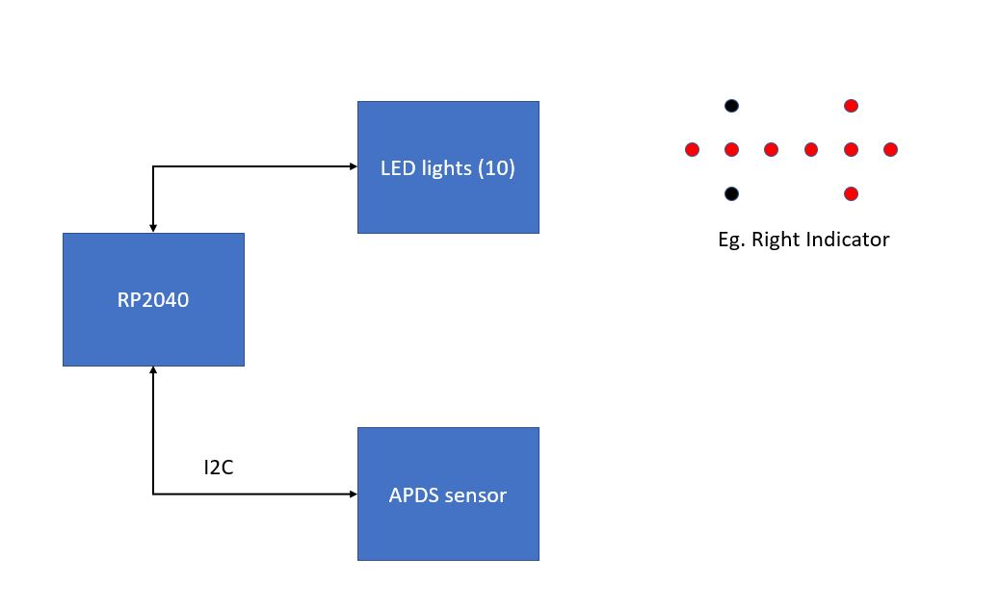

# Blinking LED

# The Proposal - Direction indicators for cars

We will be using the gesture sensing ability from lab 1 to check if the hand motion is right or left. Then 10 LED lights placed in a particular structure will blink and form a corresponding pattern of right ot left arrow. This whole concept somewhat resembles car's rear indicators. 

Block Diagram:

# Components Required 

10 LED lights, 10 resistors, wires.

# Mini Project Results - Car Indicator 

