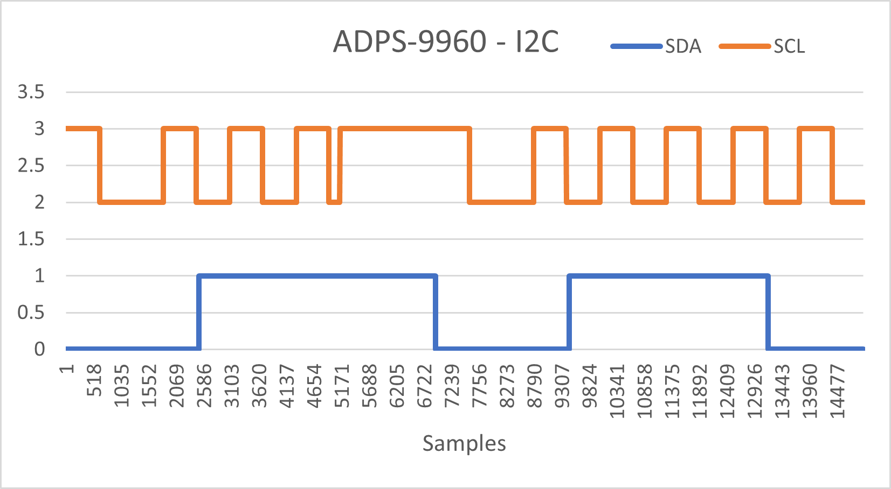

### TODO:

- modify the PIO/DMA logic analyzer example to record a timestamped trace of an RP2040-ADPS9960 exchange while the BOOT button is pressed
- with a partner, connect a second Qt Py to the Stemma Qt bus of an ADPS9960 that's attached to a first Qt Py running the Lab 1 Python code
- record a trace of this exchange

### My Notes

Modified the logic analyzer to capture a greater number of samples and to output the results in a CSV format.

Captured data is available in [capture_1.csv](capture_1.csv)

